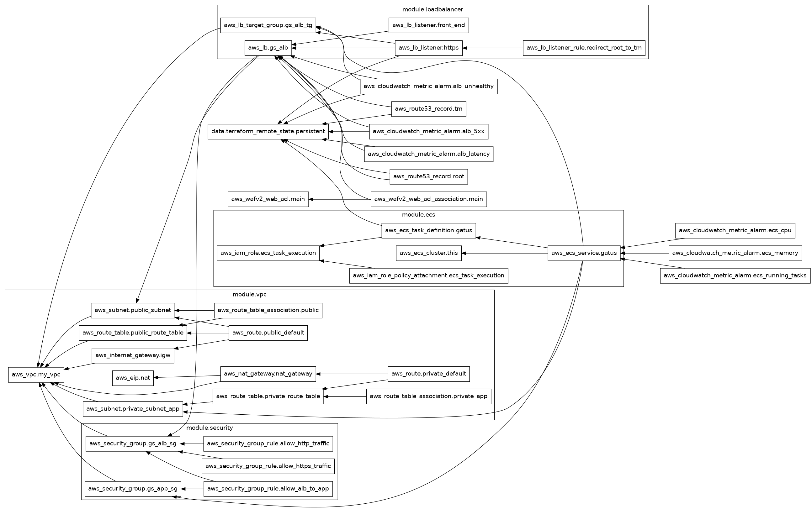
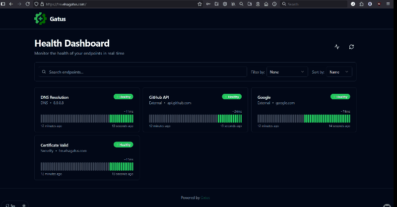
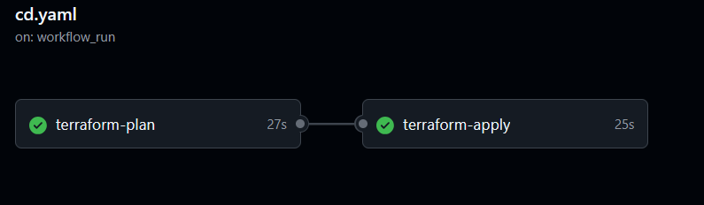

# Gatus ECS

> Automated deployment of Gatus health monitoring to AWS ECS Fargate with security scanning and CI/CD.

## What This Does

Deploys Gatus, a health monitoring application, to AWS using containers. When I push code to GitHub, it automatically:

- Builds a secure container image
- Scans it for vulnerabilities
- Deploys it to AWS
- Makes it accessible at a custom domain

## Why This Exists

I wanted to learn platform engineering by building something real, not following tutorials. This project combines:

- Infrastructure as Code
- CI/CD pipelines
- Container security
- AWS networking

Without this automation, deploying would require manual steps every time — error-prone and slow.

## How It Works (High Level)

1. **Push code to GitHub** — triggers the pipeline automatically
2. **Build and scan** — creates a container image, checks for security vulnerabilities
3. **Deploy infrastructure** — Terraform creates the AWS resources needed
4. **Gatus goes live** — accessible at tm.elsagatus.com behind a load balancer

## Key Features

- **Two-layer architecture:** Persistent resources (identity, registry) separated from ephemeral compute — can destroy and recreate without breaking CI/CD
- **Security scanning:** Trivy scans containers for CVEs, Checkov scans infrastructure code for misconfigurations
- **No static credentials:** Uses OIDC for GitHub Actions to assume AWS roles — no access keys to leak
- **Immutable image tags:** Container images can't be overwritten — prevents supply chain attacks
- **Automated dependency updates:** Dependabot watches Terraform, Docker, and GitHub Actions versions
- **Manual approval gates:** Production deployments require explicit approval via GitHub Environments — prevents accidental infrastructure changes

## Technology Choices

- **Terraform:** Infrastructure as code — reproducible, version-controlled AWS resources
- **GitHub Actions:** CI/CD that integrates with my repo — no separate CI server needed
- **AWS ECS Fargate:** Serverless containers — no EC2 instances to manage
- **OIDC authentication:** Industry standard for secure CI/CD — recommended by AWS and GitHub
- **Trivy + Checkov:** Open source security scanners — catches vulnerabilities before deployment

## Architecture Overview



Modular Terraform structure: VPC with public/private subnets, ALB in public, ECS Fargate in private, security groups restricting traffic flow. Remote state links to persistent layer (OIDC, ECR, ACM, Route 53 zone)


## Demo

### Gatus Dashboard


### CI Pipeline


### CD Pipeline with Approval



### Manual Destroy Pipeline
!{Destroy Pipeline}(images_gifs/destroy.png)

## Getting Started (For Developers)

### Prerequisites

- AWS account with appropriate permissions
- Terraform >= 1.0
- GitHub repository
- Domain name with Route 53 hosted zone

### Installation

```markdown
# Clone the repository
git clone https://github.com/ElsaDevOps/Gatus-ECS.git
cd Gatus-ECS

# Apply persistent layer first (one-time setup)
cd infrastructure/persistent
terraform init
terraform apply

# Ephemeral layer is applied via CI/CD on push to main


### Running the Project

Push to `main` branch triggers automatic deployment.

To manually destroy ephemeral infrastructure:
- Go to Actions → "Destroy Gatus" → Run workflow → type `destroy`
```

## Project Status

**Current state:** Working / Portfolio project

**What's working:**
- Full CI/CD pipeline (build, scan, push, deploy)
- Security scanning gates (Trivy, Checkov)
- Automated dependency updates
- Manual destroy workflow
- Live Gatus at tm.elsagatus.com

**What's planned:**
- Add path filtering (only rebuild image when Dockerfile changes)
- Scope IAM resources for ECS/ELB Delete* and Modify* actions to gatus-*


## Challenges & Learnings

- **Challenge:** Destroyed my OIDC role during cost-saving teardown, broke CI/CD completely → **Solution:** Designed two-layer architecture to separate persistent identity from ephemeral compute

- **Challenge:** Pipeline re-runs failed on immutable ECR tags → **Solution:** Added image existence check to skip build if image already exists

- **Challenge:** Terraform state lock conflicts from cancelled pipelines → **Solution:** Added concurrency control to queue runs instead of running in parallel

- **Learning:** Trivy found 2 HIGH severity CVEs in my Go base image — updated from Go 1.24.4 to 1.24.11 to remediate

- **Learning:** AWS console organisation doesn't match IAM service namespaces — ALB is under `elasticloadbalancing`, not `ec2`

## Metrics

| Metric | Value |
|--------|-------|
| Container image size | 24 MB |
| Checkov checks passing | 31+ |
| CVEs remediated | 2 |
| Security gates | 2 |

## Questions or Issues?

Open an issue on GitHub or connect with me on LinkedIn.
